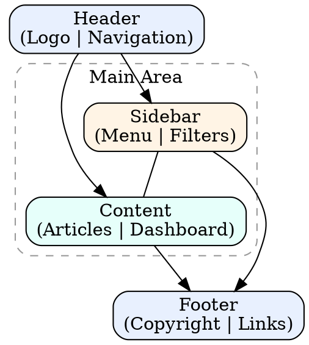
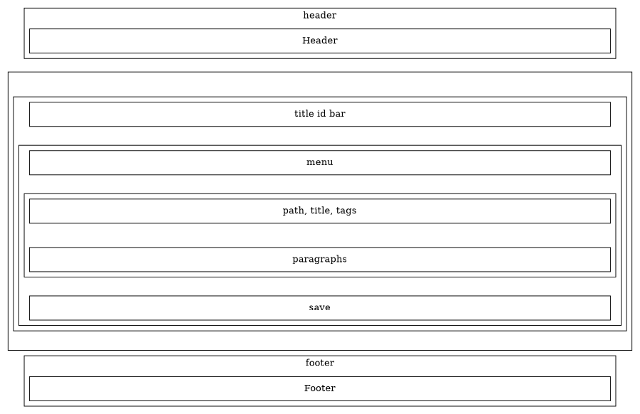
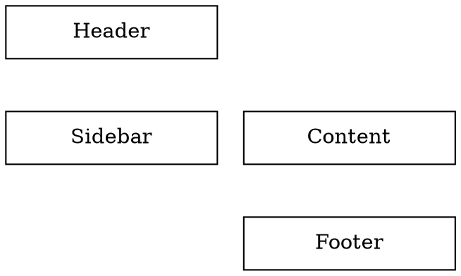
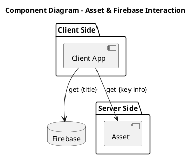

# wccn

## 1. Layout



## 2. title page





## .dot guidle

padding, margin
align node: A -> B [style=invis]

### layout

  layout=neato;
  rankdir=TB;
  subgraph cluster_ {}

### resize graph to fit

  size="6,8!";
  ratio=compress;

## optimize

### One login - both firebase and docs API

|Service|Auth|
|-|-|
|Firestore|Firebase Auth (Google provider)|
|Docs API|Same Google account OAuth token|

Flow:

- User signs in with Google (Firebase Auth)
- Firebase gives:
  - Firebase ID token (Firestore)
  - Google OAuth access token (Docs API)
- Use:
  - Firestore SDK normally
  - gapi.client.docs with OAuth token

? One login
? Same user
? Secure
? Supported

? React example (Firebase Auth)

```js
import { GoogleAuthProvider, signInWithPopup } from "firebase/auth";

const provider = new GoogleAuthProvider();
provider.addScope("https://www.googleapis.com/auth/documents");

const result = await signInWithPopup(auth, provider);

// Google OAuth token
const accessToken = GoogleAuthProvider.credentialFromResult(result)
  .accessToken;
```

Use token for Docs API:

```js
gapi.client.setToken({ access_token: accessToken });
```

## content



## export keys

```python
os.makedirs(os.path.join(tmp_dir, 'keys'), exist_ok=True)
for key in result:
    with open(f"{tmp_dir}/keys/{key['id']}.json", "w", encoding="utf-8") as f:
        json.dump(key, f, indent=2, ensure_ascii=False)
```

## env

VITE_TITLE=app-name
VITE_API=''
VITE_FIREBASE_API_KEY=
VITE_FIREBASE_AUTH_DOMAIN=
VITE_FIREBASE_PROJECT_ID=
VITE_FIREBASE_STORAGE_BUCKET=
VITE_FIREBASE_MESSAGING_SENDER_ID=
VITE_FIREBASE_APP_ID=
VITE_FIREBASE_MEASUREMENT_ID=
VITE_GOOGLE_CLIENT_ID=
VITE_USE_EMU=yes/no
